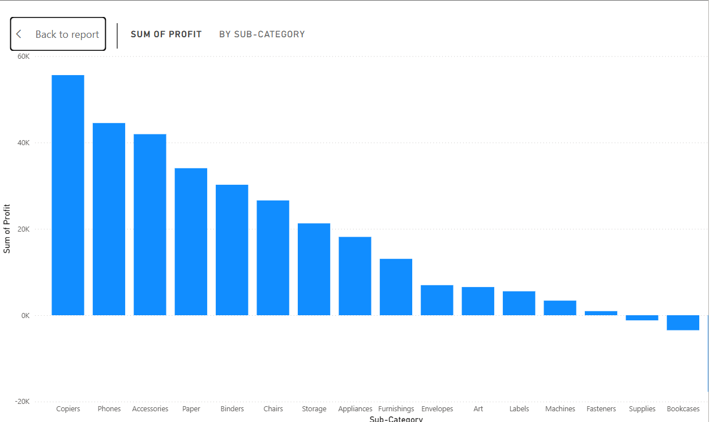

# Adaku_data_portfolio
Hello, my name is Ukaha Adaku Ekere, a data analyst passionate about turning raw data into insights.
This Portfolio is a collection of data analysis project exploring different datasets using Excel, SQL, Power BI.

# Project structure
Data: Raw and Cleaned dataset
Excel_analysis: Cleaned dataset, formatting, pivot table and dashboard
SQL_analysis: SQL queries for insights
Power_BI_analysis: Interactive visuals and dashboard
Visuals: Screenshots of dashboard from Excel and Power BI

# Key Insights
Technology category leads with 36.4% sales.
.
Copiers are most profitable while Table show losses
.
Peak month sale is on November.
.
Increase in discount reduce profit margin
.

# Connect with me
Email: ukahaoluchi84@gmail.com
Linkedin: https://www.linkedin.com/in/adaku-ukaha-512408377?utm_source=share&utm_campaign=share_via&utm_content=profile&utm_medium=android_app
